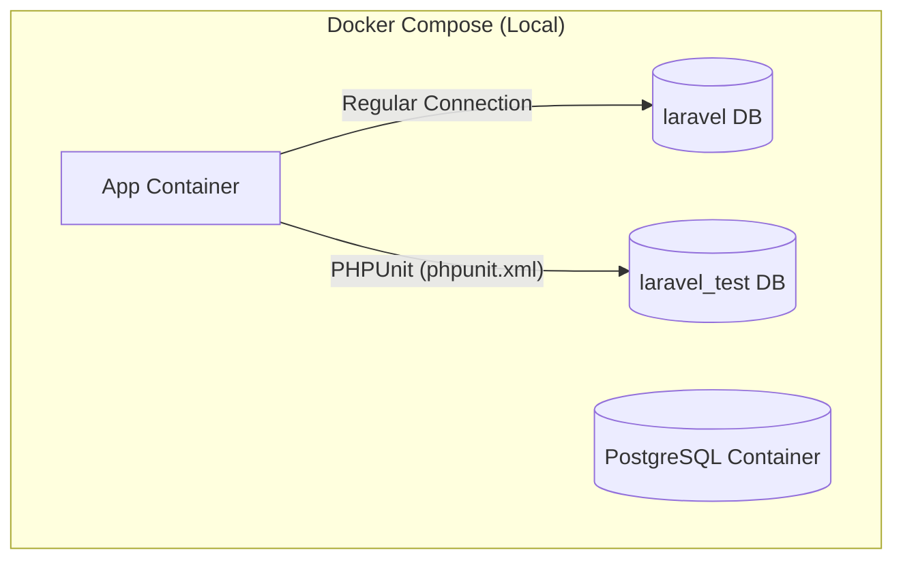

# デザインドキュメント：データベーステスト環境の分離と本番・ローカルの切り分け

## 1. 目的と背景
ローカルでの機能開発時、ブラウザから手動で登録した動作確認用データが、自動テスト（PHPUnit）の実行によってリセット・破壊される問題を防ぎます。
テスト専用のデータベースをPostgreSQL内に作成し、開発用データベースと完全に分離することで、手動確認と自動テストをストレスなく並行実行できる環境を構築します。
また、本番環境（`production`）にはテスト用の不要なデータベースが作成されないよう、環境変数による厳格な切り分けを行います。

## 2. アーキテクチャとアプローチ
推奨案である「同一PostgreSQLコンテナ内での複数DB分離アプローチ」を採用します。

### 構成概要


### 主な設定方針
1. **DBコンテナ初期化時にテストDBを自動作成:**
   PostgreSQLの公式Dockerイメージの機能を利用し、コンテナ起動時に `/docker-entrypoint-initdb.d/init-db.sh` を実行して `laravel_test` を自動作成します。
2. **本番環境へのテストDB作成防止:**
   初期化スクリプト内で、環境変数 `APP_ENV` が `local` または `testing` の場合のみ `laravel_test` データベースを作成する条件分岐を導入します。
3. **テスト用データベース接続の切り替え:**
   `phpunit.xml` にて、テスト実行時の `DB_DATABASE` 環境変数を `laravel_test` に固定します。

---

## 3. 具体的な変更箇所と設計

### A. 初期化スクリプトの新規作成
*   **ファイル名:** `docker/postgres/init-db.sh`
*   **役割:** PostgreSQLの初回起動時に実行され、開発用DB（`laravel`）の他にテスト用DB（`laravel_test`）を作成します。
*   **コード例:**
    ```bash
    #!/bin/bash
    set -e

    # APP_ENV が local または testing の場合のみテストDBを作成
    if [ "$APP_ENV" = "local" ] || [ "$APP_ENV" = "testing" ]; then
        echo "Creating testing database: laravel_test..."
        psql -v ON_ERROR_STOP=1 --username "$POSTGRES_USER" --dbname "$POSTGRES_DB" <<-EOSQL
            CREATE DATABASE laravel_test;
            GRANT ALL PRIVILEGES ON DATABASE laravel_test TO "$POSTGRES_USER";
    EOSQL
        echo "Testing database created successfully."
    else
        echo "Skipping testing database creation (APP_ENV=$APP_ENV)"
    fi
    ```

### B. DockerfileとDocker Compose設定の更新
初期化スクリプトをボリュームマウントではなく、イメージビルド時にイメージ内部へ直接組み込みます（本番・ローカルを通じたポータビリティと信頼性の担保のため）。

*   **Dockerfile変更 (`docker/postgres/Dockerfile`):**
    ```dockerfile
    FROM postgres:16.10
    COPY init-db.sh /docker-entrypoint-initdb.d/
    RUN chmod +x /docker-entrypoint-initdb.d/init-db.sh
    ```
*   **Docker Compose変更 ([compose.yaml](file:///Users/oki2a24/laravel-boilerplate/compose.yaml)):**
    `db` サービスに `APP_ENV` 環境変数を追加し、ホスト（または `.env`）から引き渡します（ボリュームマウントは不要です）。
    ```yaml
      db:
        build:
          context: ./docker/postgres
        environment:
          - APP_ENV=${APP_ENV:-local}  # 追加
          - LANG=C.UTF-8
          - POSTGRES_PASSWORD=${DB_PASSWORD}
          - POSTGRES_USER=${DB_USERNAME}
          - POSTGRES_DB=${DB_DATABASE}
          - POSTGRES_INITDB_ARGS=--encoding=UTF-8 --locale=C.UTF-8
          - TZ=Asia/Tokyo
    ```

### C. PHPUnit設定の更新
*   **ファイル名:** [phpunit.xml](file:///Users/oki2a24/laravel-boilerplate/phpunit.xml)
*   **変更内容:** コメントアウトされているSQLiteのダミー設定を削除し、PostgreSQLのテスト用DB設定（`laravel_test`）を明示的に有効化します。
*   **設定例:**
    ```xml
      <php>
        <env name="APP_ENV" value="testing"/>
        <env name="BCRYPT_ROUNDS" value="4"/>
        <env name="CACHE_DRIVER" value="array"/>
        <env name="DB_CONNECTION" value="pgsql"/>          <!-- 変更 -->
        <env name="DB_DATABASE" value="laravel_test"/>    <!-- 変更 -->
        <env name="MAIL_MAILER" value="array"/>
        <env name="QUEUE_CONNECTION" value="sync"/>
        <env name="SESSION_DRIVER" value="array"/>
        <env name="TELESCOPE_ENABLED" value="false"/>
      </php>
    ```

### D. ドキュメンテーションと学習用ナレッジの整備
人間および今後のAIエージェントが、本構成（手動確認用DBとテスト用DBの分離、本番でのテストDB作成防止）を正しく理解し、次回以降の開発に活用できるようにナレッジを蓄積します。

*   **対象ファイル:**
    1.  [README.md](file:///Users/oki2a24/laravel-boilerplate/README.md)（人間用ドキュメント）
        「テスト環境のセットアップとデータ分離について」の項目を追加し、テスト用DBが独立していること、および既存ボリュームの再作成方法を明記します。
    2.  [GEMINI.md](file:///Users/oki2a24/laravel-boilerplate/GEMINI.md) / [AGENTS.md](file:///Users/oki2a24/laravel-boilerplate/AGENTS.md)（AIエージェント用ドキュメント）
        「データベースの分離ルール（ローカルでは必ず PostgreSQL で `laravel_test` を使用すること。SQLite への切り替えは原則行わないこと）」を指示として追記し、エージェントが前提知識として学習できるようにします。

---

## 4. 懸念点とリカバリプラン

### 懸念点: 既存のDockerボリュームによる初期化スクリプトの不作動
PostgreSQLコンテナは、すでにDBボリュームが作成されている場合、`/docker-entrypoint-initdb.d` に配置されたスクリプトを実行しません（コンテナが空のときのみ実行される仕様のため）。

### 対策・リカバリプラン
既存の開発環境においてテスト用DBを作成するために、以下の2つの手順のいずれかを開発者に提供します。

1.  **最も確実な方法（DBの完全リセット）:**
    既存のDBコンテナとボリュームを削除して、再度ビルドして立ち上げ直します。これにより、初期化スクリプトが正しく実行されます。
    ```bash
    # コンテナ停止とボリューム削除
    make stop
    docker compose down -v
    
    # 再ビルドと起動
    make up
    ```
    *(※ただし、現在手動で入れているデータは消去されます)*

2.  **手動データ保護方法（手動でテストDBを作成）:**
    既存のデータを消したくない場合は、コンテナに入り、手動で一度だけSQLを実行してテストDBを作成します。
    ```bash
    # dbコンテナに入って psql を起動し、DBを作成する
    docker compose exec db psql -U app -d laravel -c "CREATE DATABASE laravel_test;"
    ```

---

## 5. 動作検証方法

### 検証ステップ1: テストDBが作成されているかの確認
1. ボリュームを削除してコンテナを再起動（`docker compose down -v && make up`）します。
2. データベース一覧を表示し、`laravel` と `laravel_test` の2つが存在することを確認します。
   ```bash
   docker compose exec db psql -U app -d laravel -l
   ```

### 検証ステップ2: テストの実行確認
1. テストを実行します。
   ```bash
   make php-test
   ```
2. すべてのテストがパス（Green）になることを確認します。

### 検証ステップ3: 手動確認用データの保護の確認
1. 手動で `laravel` DBにテスト用のデータ（例: ユーザーなど）を挿入します。
2. `make php-test` を実行します。
3. `laravel` DB内のデータが消去・変更されずに残っていることを確認します。
